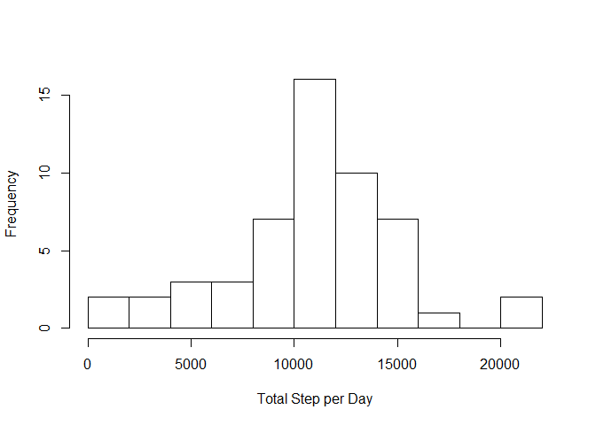
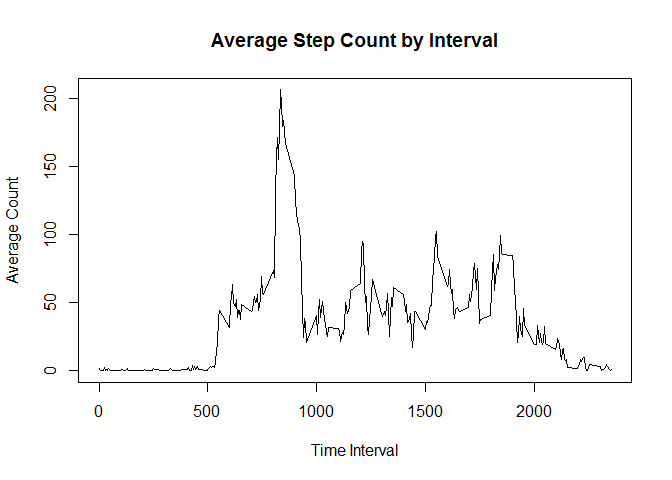
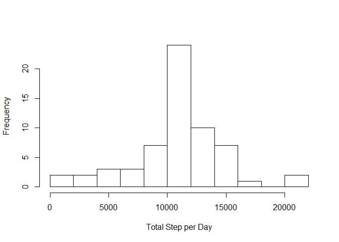
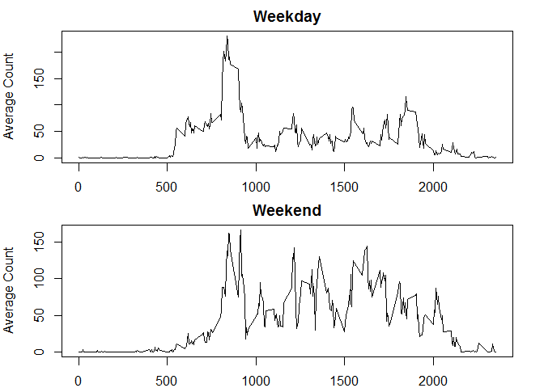

# Reproducible Research: Peer Assessment 1


## Loading and preprocessing the data
The file called "activity.csv" is put along with this R markdown file in the same folder. Assign "step", "date" and "interval" to the column names for later use.


```r
filename <- "activity.csv"
data <- read.csv(filename,
                 #colClasses = c("numeric", "character", "numeric"),
                 col.names = c("step", "date", "interval")
                 )
```


## What is mean total number of steps taken per day?
The following is the distribution chart (histgram) of the total step of each day. 
The most frequency occurs around 10000~12000 steps per day.

```r
sum_PerDay <- tapply(data$step, data$date, sum)
hist(sum_PerDay, 
     breaks = 10, xlab = "Total Step per Day", 
     main = ""
     )
```

 

The mean and median values are listed as follow.

```r
summary(sum_PerDay)
```

```
##    Min. 1st Qu.  Median    Mean 3rd Qu.    Max.    NA's 
##      41    8841   10760   10770   13290   21190       8
```


## What is the average daily activity pattern?
The following figure shows the average step of each interval in a day.

```r
data <- transform(data, interval = factor(interval))
f <- factor(data$interval)
mean_ByInterval <- tapply(data$step, f, mean, na.rm = TRUE)
plot(x = levels(data$interval), y = mean_ByInterval, 
     type = "l", main = "Average Step Count by Interval",
     xlab = "Time Interval", ylab = "Average Count"
     )
```

 

From the following code, the interval with the maximum value is 0835.


```r
for (n in 1:nrow(mean_ByInterval)){
        if (mean_ByInterval[n] == max(mean_ByInterval)){
                interval_max <- row.names(mean_ByInterval)[n];
        }
}
interval_max
```

```
## [1] "835"
```

## Imputing missing values
First, we check the number of NAs in the original dataset, "data."


```r
# Calculate the number of NAs in data set
sum(is.na(data$step))
```

```
## [1] 2304
```

The strategy used in the following code is to fill up the NAs with the average  (mean) values of the related 5 min. interval of the rest days. 


```r
# Reconstruct the new data set "data_Ex"
data_Ex <- data

for (n in 1:nrow(data)){
        if (is.na(data_Ex$step[n])){
                # used to debug
                data_Ex$step[n] <- mean_ByInterval[(n-1) %% 288 + 1]
        }
}
```

The following is the histogram of the new data set.

```r
# Generate the mean and median from the new data set "data_Ex"
sum_PerDay_Ex <- tapply(data_Ex$step, data_Ex$date, sum)
hist(sum_PerDay_Ex, 
     breaks = 10, xlab = "Total Step per Day", 
     main = ""
     )
```

 

The following is the summary of the original data set.

```r
summary(sum_PerDay)
```

```
##    Min. 1st Qu.  Median    Mean 3rd Qu.    Max.    NA's 
##      41    8841   10760   10770   13290   21190       8
```

The following is the summary of the new data set.

```r
summary(sum_PerDay_Ex)
```

```
##    Min. 1st Qu.  Median    Mean 3rd Qu.    Max. 
##      41    9819   10770   10770   12810   21190
```
The values of mean is the same because I adopt the mean value to fill up the NAs. The values of median changes slightly 10765 to 10766.19. Due to the filling strategy, we have introduce new samples near the mean values. The median will also move near to the mean value.

## Are there differences in activity patterns between weekdays and weekends?

"g" is the factor to indicate "weekday" and "weekend." Factor "g" is used to 
split the data into two data sets, "data_weekday" and "data_weekend".


```r
date <- as.POSIXlt(data$date,format="%Y-%m-%d")
ss <- weekdays(date)
g <- factor(ss)
levels(g) <- c("weekday", "weekday", "weekday", "weekday", "weekend", "weekend", "weekday")
data_Ex_split <- split(data_Ex, g)
data_weekday <- data_Ex_split[[1]]
data_weekend <- data_Ex_split[[2]]
```

The following figure shows the comparison of weekday and weekend. During the weekday, the activities occur much more before 10:00. During the weekend, the activities seems 
to be spread out from 8:00~21:00.


```r
par(mfcol = c(2, 1), mar = c(2,4,2,2))

data_show <- data_weekday
f <- factor(data_show$interval)
mean_ByInterval <- tapply(data_show$step, f, mean, na.rm = TRUE)
plot(x = levels(data_show$interval), y = mean_ByInterval, 
     type = "l",
     xlab = "Time Interval", ylab = "Average Count",
     main = "Weekday"
     )

data_show <- data_weekend
f <- factor(data_show$interval)
mean_ByInterval <- tapply(data_show$step, f, mean, na.rm = TRUE)
plot(x = levels(data_show$interval), y = mean_ByInterval, 
     type = "l",
     xlab = "Time Interval", ylab = "Average Count",
     main = "Weekend"
     )
```

 

